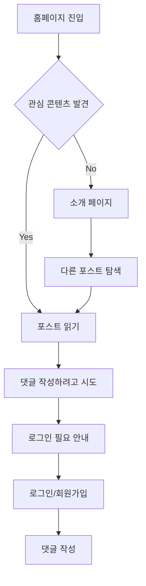
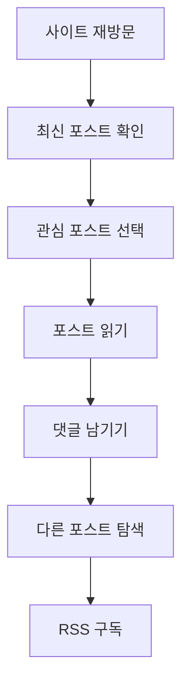

# 블로그 정보 구조 (Information Architecture)

Jin's Next.js Blog 프로젝트의 정보 구조와 네비게이션 설계 문서입니다.

## 목차
- [사이트 구조 개요](#사이트-구조-개요)
- [라우팅 아키텍처](#라우팅-아키텍처)
- [네비게이션 시스템](#네비게이션-시스템)
- [콘텐츠 분류](#콘텐츠-분류)
- [사용자 여정](#사용자-여정)
- [SEO 구조](#seo-구조)
- [검색 및 필터링](#검색-및-필터링)
- [확장성 고려사항](#확장성-고려사항)

## 사이트 구조 개요

### 1. 사이트 목적
- **개인 블로그**: 개발 경험과 지식 공유
- **포트폴리오**: 개발 역량과 프로젝트 소개
- **실시간 협업**: Liveblocks를 활용한 댓글 및 피드백 시스템
- **지식 아카이브**: 체계적인 개발 지식 정리

### 2. 주요 사용자 그룹
- **방문자 (Guest)**: 콘텐츠 소비, 검색, 브라우징
- **인증된 사용자 (User)**: 댓글, 피드백, 개인 맞춤 기능
- **관리자 (Admin)**: 콘텐츠 작성, 편집, 관리

## 라우팅 아키텍처

### 1. Next.js 15 App Router 구조

```
src/app/
├── layout.tsx                 # 루트 레이아웃
├── not-found.tsx             # 404 페이지
├── robots.ts                 # SEO 설정
├── sitemap.ts               # 사이트맵 생성
├── (public)/                # 공개 페이지 그룹
│   ├── layout.tsx           # 공개 페이지 레이아웃
│   ├── page.tsx            # 홈페이지 (/)
│   ├── about/              # 소개 페이지
│   │   └── page.tsx        # /about
│   ├── posts/              # 블로그 포스트
│   │   ├── page.tsx        # /posts (포스트 목록)
│   │   └── [slug]/
│   │       └── page.tsx    # /posts/[slug] (개별 포스트)
│   ├── signin/             # 로그인 페이지
│   │   └── page.tsx        # /signin
│   └── @modal/             # 병렬 라우팅 (모달)
│       ├── default.tsx
│       └── (.)signin/      # 인터셉터 라우트
│           └── page.tsx    # 모달 로그인
├── (private)/              # 인증 필요 페이지
│   └── write/              # 포스트 작성
│       ├── layout.tsx
│       └── page.tsx        # /write
└── api/                    # API 라우트
    ├── auth/[...nextauth]/ # NextAuth.js
    ├── comments/           # 댓글 API
    ├── liveblocks-auth/    # Liveblocks 인증
    ├── post/               # 포스트 CRUD API
    ├── upload/             # 파일 업로드
    ├── user-info/          # 사용자 정보
    └── users/              # 사용자 관리
```

### 2. 라우트 분류

#### 공개 라우트 (Public Routes)
```javascript
const publicRoutes = [
  '/',              // 홈페이지
  '/about',         // 소개 페이지
  '/posts',         // 포스트 목록
  '/posts/[slug]',  // 개별 포스트
  '/signin',        // 로그인 페이지
];
```

#### 보호된 라우트 (Protected Routes)
```javascript
const protectedRoutes = [
  '/write',         // 포스트 작성 (인증 필요)
];
```

#### API 라우트
```javascript
const apiRoutes = [
  '/api/auth/*',        // 인증 관련
  '/api/post/*',        // 포스트 CRUD
  '/api/comments',      // 댓글 시스템
  '/api/liveblocks-auth', // 실시간 협업 인증
  '/api/upload',        // 파일 업로드
  '/api/users',         // 사용자 관리
  '/api/user-info',     // 사용자 정보
];
```

## 네비게이션 시스템

### 1. 주 네비게이션 (Primary Navigation)

#### 헤더 네비게이션
```typescript
interface NavigationItem {
  label: string;
  href: string;
  icon?: React.ComponentType;
  requireAuth?: boolean;
}

const primaryNavigation: NavigationItem[] = [
  { label: '홈', href: '/' },
  { label: '포스트', href: '/posts' },
  { label: '소개', href: '/about' },
  { label: '작성하기', href: '/write', requireAuth: true },
];
```

#### 모바일 네비게이션
```typescript
const mobileNavigation = [
  ...primaryNavigation,
  { label: '로그인', href: '/signin', showWhenLoggedOut: true },
  { label: '로그아웃', href: '/signout', showWhenLoggedIn: true },
];
```

### 2. 보조 네비게이션 (Secondary Navigation)

#### 포스트 페이지 네비게이션
```typescript
const postNavigation = {
  breadcrumb: ['홈', '포스트', '현재 포스트 제목'],
  pagination: {
    prev: '이전 포스트',
    next: '다음 포스트'
  },
  toc: '목차 (Table of Contents)', // 자동 생성
};
```

#### 사이드바 네비게이션
```typescript
const sidebarNavigation = {
  categories: [
    'React/Next.js',
    'TypeScript',
    'Web Development',
    'DevOps',
    '알고리즘',
    '회고'
  ],
  tags: ['동적 태그 목록'],
  recentPosts: ['최근 포스트 5개'],
};
```

### 3. 네비게이션 상태 관리
```typescript
// 네비게이션 컨텍스트
interface NavigationContext {
  currentPath: string;
  breadcrumb: BreadcrumbItem[];
  isMenuOpen: boolean;
  toggleMenu: () => void;
}
```

## 콘텐츠 분류

### 1. 콘텐츠 계층 구조

```
사이트 루트
├── 개인 소개
│   ├── 프로필
│   ├── 경험
│   ├── 기술 스택
│   ├── 프로젝트
│   └── 교육
├── 블로그 포스트
│   ├── 카테고리별 분류
│   │   ├── React/Next.js
│   │   ├── TypeScript
│   │   ├── Web Development
│   │   ├── DevOps
│   │   ├── 알고리즘
│   │   └── 회고
│   ├── 태그별 분류
│   └── 시간순 정렬
└── 메타 페이지
    ├── 로그인/로그아웃
    ├── 포스트 작성
    └── 사용자 설정
```

### 2. 콘텐츠 메타데이터 구조

```typescript
interface PostMetadata {
  // 기본 정보
  title: string;
  slug: string;
  description: string;
  
  // 분류
  category: string;
  tags: string[];
  
  // 시간 정보
  publishedAt: string;
  updatedAt: string;
  
  // 콘텐츠
  markdown: string;
  readingTime: number;
  
  // SEO
  seoTitle?: string;
  seoDescription?: string;
  ogImage?: string;
  
  // 상태
  status: 'draft' | 'published' | 'archived';
  featured: boolean;
}
```

### 3. 태그 시스템

#### 기술 태그
```typescript
const techTags = [
  'JavaScript', 'TypeScript', 'React', 'Next.js',
  'Node.js', 'Python', 'Docker', 'AWS',
  'Git', 'VS Code', 'Tailwind CSS', 'Supabase'
];
```

#### 주제 태그
```typescript
const topicTags = [
  'Tutorial', 'Tips', 'Review', 'Project',
  'Performance', 'Security', 'Testing', 'Deployment',
  'Career', 'Learning', 'Problem Solving'
];
```

## 사용자 여정 (User Journey)

### 1. 첫 방문자 여정


### 2. 재방문자 여정


### 3. 작성자 여정 (관리자)
```mermaid
graph TD
    A[로그인] --> B[/write 페이지 접근]
    B --> C[포스트 작성]
    C --> D[실시간 미리보기]
    D --> E[이미지 업로드]
    E --> F[태그 설정]
    F --> G[발행]
    G --> H[포스트 확인]
    H --> I[댓글 관리]
```

## SEO 구조

### 1. URL 구조
```
도메인: https://jin-blog.dev/

# 페이지 URL 패턴
/                           # 홈페이지
/about                      # 소개 페이지
/posts                      # 포스트 목록
/posts/[slug]               # 개별 포스트
/posts/category/[category]  # 카테고리별 포스트 (향후 확장)
/posts/tag/[tag]           # 태그별 포스트 (향후 확장)
/signin                     # 로그인
/write                      # 포스트 작성

# API URL 패턴
/api/post/[slug]           # 포스트 CRUD
/api/comments              # 댓글 시스템
/api/upload                # 파일 업로드
```

### 2. 메타데이터 전략

#### 홈페이지
```typescript
export const homeMetadata = {
  title: "진철진의 개발 블로그 | Jin's Dev Blog",
  description: "웹 개발, React, Next.js, TypeScript에 대한 실전 경험과 인사이트를 공유합니다.",
  keywords: "개발자, 웹개발, React, Next.js, TypeScript, 프론트엔드, 풀스택",
  openGraph: {
    type: 'website',
    locale: 'ko_KR',
    url: 'https://jin-blog.dev',
    title: "진철진의 개발 블로그",
    description: "웹 개발 실전 경험과 인사이트 공유",
    images: ['/images/og-home.png'],
  },
};
```

#### 포스트 페이지
```typescript
export const generatePostMetadata = (post: Post) => ({
  title: `${post.title} | Jin's Dev Blog`,
  description: post.description,
  keywords: ['개발', 'programming', ...post.tags].join(', '),
  openGraph: {
    type: 'article',
    title: post.title,
    description: post.description,
    url: `https://jin-blog.dev/posts/${post.slug}`,
    publishedTime: post.publishedAt,
    modifiedTime: post.updatedAt,
    tags: post.tags,
    images: [post.ogImage || '/images/og-default.png'],
  },
  twitter: {
    card: 'summary_large_image',
  },
});
```

### 3. 구조화된 데이터 (JSON-LD)

#### 블로그 사이트
```json
{
  "@context": "https://schema.org",
  "@type": "Blog",
  "name": "진철진의 개발 블로그",
  "description": "웹 개발 실전 경험과 인사이트 공유",
  "url": "https://jin-blog.dev",
  "author": {
    "@type": "Person",
    "name": "진철진",
    "url": "https://jin-blog.dev/about"
  },
  "publisher": {
    "@type": "Person",
    "name": "진철진"
  }
}
```

#### 개별 포스트
```json
{
  "@context": "https://schema.org",
  "@type": "BlogPosting",
  "headline": "포스트 제목",
  "description": "포스트 설명",
  "image": "OG 이미지 URL",
  "author": {
    "@type": "Person",
    "name": "진철진"
  },
  "publisher": {
    "@type": "Person",
    "name": "진철진"
  },
  "datePublished": "2024-01-01",
  "dateModified": "2024-01-02",
  "mainEntityOfPage": {
    "@type": "WebPage",
    "@id": "https://jin-blog.dev/posts/slug"
  }
}
```

## 검색 및 필터링

### 1. 검색 기능

#### 전체 검색
```typescript
interface SearchQuery {
  query: string;
  category?: string;
  tags?: string[];
  dateRange?: {
    start: Date;
    end: Date;
  };
  sortBy: 'relevance' | 'date' | 'title';
  sortOrder: 'asc' | 'desc';
}
```

#### 검색 구현
```typescript
// API 엔드포인트: /api/search
export async function searchPosts(searchQuery: SearchQuery) {
  const { query, category, tags, dateRange, sortBy, sortOrder } = searchQuery;
  
  let sqlQuery = supabase
    .from('posts')
    .select('*')
    .eq('status', 'published');
  
  if (query) {
    sqlQuery = sqlQuery.or(`title.ilike.%${query}%,description.ilike.%${query}%,markdown.ilike.%${query}%`);
  }
  
  if (category) {
    sqlQuery = sqlQuery.eq('category', category);
  }
  
  if (tags && tags.length > 0) {
    sqlQuery = sqlQuery.overlaps('tags', tags);
  }
  
  // 정렬 적용
  const sortColumn = sortBy === 'date' ? 'published_at' : sortBy;
  sqlQuery = sqlQuery.order(sortColumn, { ascending: sortOrder === 'asc' });
  
  return sqlQuery;
}
```

### 2. 필터링 UI

#### 포스트 목록 필터
```typescript
interface FilterState {
  category: string;
  tags: string[];
  dateRange: DateRange;
  searchQuery: string;
}

const FilterComponent = () => {
  const [filters, setFilters] = useState<FilterState>();
  
  return (
    <div className="filter-panel">
      <SearchInput onSearch={handleSearch} />
      <CategoryFilter categories={categories} />
      <TagFilter tags={availableTags} />
      <DateRangeFilter onDateChange={handleDateChange} />
      <SortOptions />
    </div>
  );
};
```

## 확장성 고려사항

### 1. 향후 추가 예정 페이지
```typescript
const futureRoutes = [
  '/portfolio',        // 포트폴리오 섹션
  '/projects',         // 프로젝트 상세
  '/resume',          // 이력서 페이지
  '/contact',         // 연락처 및 문의
  '/newsletter',      // 뉴스레터 구독
  '/search',          // 전용 검색 페이지
  '/archives',        // 아카이브 페이지
  '/tags/[tag]',      // 태그별 포스트
  '/category/[cat]',  // 카테고리별 포스트
  '/series/[series]', // 시리즈별 포스트
];
```

### 2. 다국어 지원 (i18n) 구조
```typescript
const i18nStructure = {
  defaultLocale: 'ko',
  locales: ['ko', 'en'],
  pages: {
    '/': {
      ko: '홈',
      en: 'Home'
    },
    '/about': {
      ko: '소개',
      en: 'About'
    },
    '/posts': {
      ko: '포스트',
      en: 'Posts'
    }
  }
};
```

### 3. 콘텐츠 관리 시스템 (CMS) 확장

#### 헤드리스 CMS 통합 고려
- **Strapi**: 자체 호스팅 CMS
- **Contentful**: 클라우드 기반 CMS
- **Sanity**: 실시간 협업 CMS
- **Ghost**: 블로그 특화 CMS

#### 현재 Supabase 기반 확장
```sql
-- 추가 테이블 구조
CREATE TABLE categories (
  id SERIAL PRIMARY KEY,
  name VARCHAR(100) NOT NULL,
  slug VARCHAR(100) UNIQUE NOT NULL,
  description TEXT,
  created_at TIMESTAMP DEFAULT NOW()
);

CREATE TABLE post_series (
  id SERIAL PRIMARY KEY,
  title VARCHAR(200) NOT NULL,
  slug VARCHAR(200) UNIQUE NOT NULL,
  description TEXT,
  posts_order INTEGER[],
  created_at TIMESTAMP DEFAULT NOW()
);

CREATE TABLE newsletter_subscribers (
  id SERIAL PRIMARY KEY,
  email VARCHAR(255) UNIQUE NOT NULL,
  subscribed_at TIMESTAMP DEFAULT NOW(),
  active BOOLEAN DEFAULT TRUE
);
```

### 4. 성능 최적화 구조

#### 정적 생성 전략
```typescript
// 정적 생성할 페이지들
const staticPages = [
  '/',           // 홈페이지
  '/about',      // 소개 페이지
  '/posts',      // 포스트 목록 (첫 페이지)
];

// ISR(Incremental Static Regeneration) 적용
const isrPages = [
  '/posts/[slug]',  // 개별 포스트 (24시간 캐시)
];

// 서버 사이드 렌더링
const ssrPages = [
  '/write',      // 실시간 데이터가 필요한 페이지
  '/search',     // 검색 결과 페이지
];
```

---

이 정보 구조를 바탕으로 사용자 경험을 최우선으로 하는 직관적이고 확장 가능한 블로그 시스템을 구축해 주세요. 새로운 페이지나 기능을 추가할 때는 이 아키텍처와의 일관성을 유지하는 것이 중요합니다.