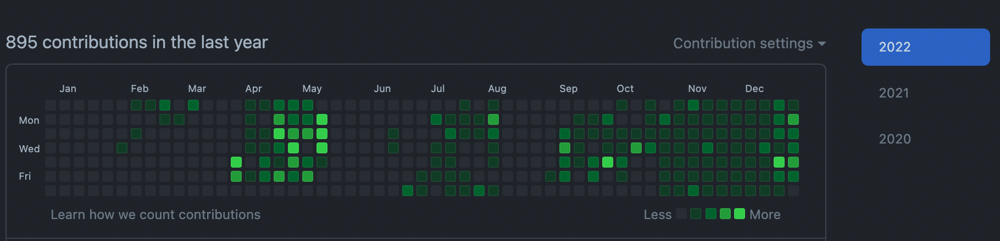

## 1. 제 2의 인생을 시작하다

- 나는 비전공자 개발자이다. 전에는 캐주얼과 여성복 개발을 하는 일을 7년 정도 하였고 코로나와 미래에 대한 전망이 보이지 않아 과감하게 전직을 생각하고 직업을 선택하던 과정에서 시작 한 디지털 마케팅 수업에서 짧게 배웠던 파이썬 수업을 시작으로 개발자로의 진로 선택에 기점이 되었다. 이게 2019년도 말에 있었던 일이다.
- 그리고 새해가 되서 우연하게 스파르타코딩클럽의 맛보기 미니프로젝트를 만들어 보았는데 꽤 재미있었다. 이게 완전 트리거가 되어 빠른시일에 제대로 된 교육을 받아보고자 찾아본 게 부트캠프였다. 그렇게 시작하여 2월부터 현재까지 10개월이 조금 넘었다.

## 2. 개발자가 되기 위해 부트캠프에 들어가다.

- 우선 현재 나는 백엔드 개발자가 되기 위해서 Java, Spring 교육을 위주로 듣고 있다. 하지만 처음 개발을 시작 할 때는 프론트엔드를 지망해서 프론트엔드 교육을 듣고 수료를 하였다.
- 부트캠프에서는 바닐라JS를 가지고 프레임워크 및 라이브러리의 도움을 최소화하고 MVC패턴으로 프로젝트를 개발하였는데 지금 생각해보면 사실 머릿속에 남아있는게 많이 없다. 그렇다고 자바스크립트를 잘 한다고 생각도 들지 않는다. 하지만 기획부터 시작해서 백엔드분과 프론트동료와 서로 협엽하여 개발하는 사이클을 경험해보았다는 게 중요하다고 생각한다.

## 3. 수료 후 위기 봉착

- 수료 후 약 2 ~ 3개월 정도 취업을 위해 이력서 및 개인공부를 이어 나갔는데 이때 프론트엔드로써 내 능력의 한계에 많이 부딪혀서 고민이 많아 졌던 시기였다. 취업을 위해서는 리엑트의 프레임워크 경험이 있거나 무언가 더 강점이 있었어야 했는데 그때 당시 나의 수준으로 프론트엔드로 원하는 회사에 취업한다는게 큰 욕심이었던 것 같다. 많은 곳을 지원해 볼 패기도 사실 없었던 것 같다.
- 그렇게 시간이 흐르고 친한 친구의 도움으로 작은 SI회사에 운좋게 입사를 하게 되었다. 그 뒤 나는 내가 하고 싶은 프론트엔드가 아닌 회사에서 사용하는 스펙에 맞게 다시 공부를 시작하였다.

## 4. SI

- 운좋게 회사에 취업은 했지만 IT쪽은 처음이라 다시 처음부터 적응하는 과정은 쉽지는 않았다. 그리고 거의 한달 반 가량은 내가 투입될 프로젝트에서 사용할 언어에 대해서 공부 하는 시간이었고 무얼 해야할 지 감이 잡히지 않는 시간이었다.
- 나의 행동의 문제, 작은 회사의 잡히지 않은 체계, 너무 많은 정보가 난무하는 유튜브의 내용들이 복합적으로 나에게 더 큰 혼란을 가져왔다.
  1. 내가 아는 것이 너무 없어서 어떤 걸 질문해야 할 지 조차도 생각하지 못했다.
  2. 회사에서도 나에게 무얼 하라고 지시해 주지도 않았다.
     1. 자바로 게시판 만들어 보라고 한게 전부였다... 그 당시에... 사실 이게 내 수준에 딱 맞는 과제 였을지도 모른다... 과제는 주셨지만 검사는 제대로 해주지 않은 이 아이러니한 상황들...
  3. 투입 프로젝트의 회의에 참여하지만 모든게 처음인 나로써는 용어들 이해하는 것으로도 버거웠다.
  4. 내가 상상했던 애자일, 코드리뷰, 수평적인 문화 등등등... 상상속의 존재가 되어버렸다.
- 그래도 일단 시작한 상황에서 무턱대고 그만두고 싶지는 않았고 도전해보자 라는 마음으로 한달... 두달... 그리고 프로젝트 투입이되어서 현재까지 오게되었다.

## 5. 그리고 현재

- 프로젝트 투입 후에도 시련같은 시간이 있었지만 현재는 만족한다.
- 지금은 많은 것을 생각하기 보다 지금 하고 있는 프로젝트를 잘 끝내는거에 많은 신경을 쓰고 있다.
- 퇴근 후에 부족한 부분을 공부하고(Spring, OOP, TDD 등등) 현재 개발업무를 하면서 적용할 수 있는 부분은 조금씩 적용해보고있다. 많은 부분은 아니지만 그래도 배운 것을 활용하고 적용한 부분이 제대로 동작하는 것을 보고 나름 만족을 하고있는 것 같다.
- 하지만 경력이 적은 만큼 모르는 부분이 너무 많고 공부해야 할 부분도 너무 많은게 현실이다. 목표 한 바를 위해서는 견뎌야 할 시간들이다.
- 현재 진행형이지만 10월 후반부터 지금까지 1일 1커밋을 실천하고 있다. 조금 늦은 감은 있긴한데 그래도 현재까지 잘 지키고 있어서 나름 뿌듯하고 욕심이 더 생기는 것 같다. 아직 양질의 커밋으로 채우지는 못하지만 그래도 1일 1커밋을 위해 조금이라도 강의를 듣고 책을 보는 행동으로도 큰 동기부여가 되는 것 같다.



## 6. 앞으로 목표

> 1. 1일 1커밋 6개월 지속하고 블로그에 기록하기
> 2. 제로베이스 한달한권 클린코드, 리펙터링 완주하기 / 블로그 기록
> 3. 퇴근 후 30분 운동 루틴 유지하기
> 4. 올해는 클라이밍 다시 시작하기

#### `아직 개발자로써 갈 길이 멀다. 조급하게 생각하지 말고 현재 내가 필요한 것 위주로 공부하고 실천하자. 그리고 좋은 코드를 만들고 좋은 제품을 만들기 위해서 항상 고민하고 노력하도록 하자. 올해도 화이팅이다!`

```toc

```
