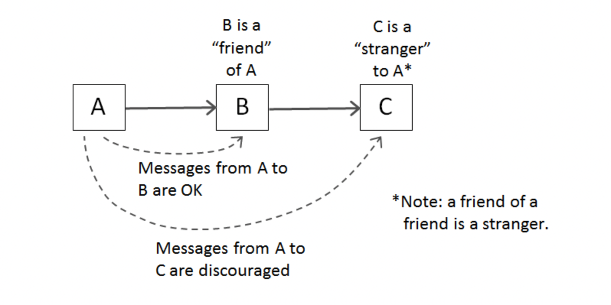
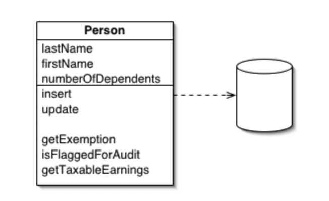
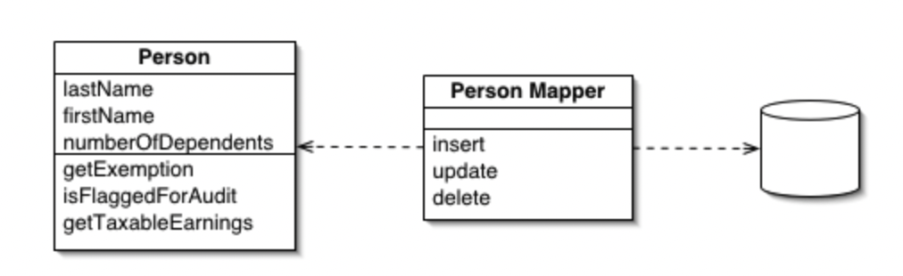

# Chapter 6 - 객체와 자료구조로 데이터 표현하기

## 01. 자료구조 vs 객체

| 자료구조(Data Structure)                                                                           | 객체(Object)                                                                        |
| -------------------------------------------------------------------------------------------------- | ----------------------------------------------------------------------------------- |
| 데이터 그 자체                                                                                     | 비즈니스 로직                                                                       |
| 자료를 공개한다.                                                                                   | 자료를 숨기고, 추상화 한다.<br>자료를 다루는 함수만 공개한다.                       |
| 변수 사이에 조회 함수와 설정 함수로 <br> 변수를 다룬다고 객체가 되지 않는다. <br> (getter, setter) | 추상 인터페이스를 제공해 사용자가 구현을 모른 채 <br> 자료의 핵심을 조작할 수 있다. |

### 자료구조 vs 객체 예시(1) Vehicle

```java
// 자료구조
public interface Vehicle {
  double getFuelTankCapacityInGallons() // 연료탱크 용량(갤던 단위)
  double getGallonsOfGasoline() // 가솔린(갤던 단위)
}

public class Car implements Vehicle {
  double fuelTankCapacityInGallons;
  double gallonsOfGasoline;

  public double getFuelTankCapacityInGallons() {
    return this.fuelTankCapacityInGallons;
  }

  public double getGallonsOfGasoline() {
    return this.gallonsOfGasoline;
  }
}
```

- 위와 같이 특별하게 비즈니스 로직이 들어가 있지 않고 단순히 값을 반환하는 경우에는 객체가 아니고 자료구조라고 할 수 있다.

```java
// 객체
public interface Vehicle {
  double getPercentFuelRemain()
}

public class Car implements Vehicle {
  double fuelTankCapacityInGallons;
  double gallonsOfGasoline;

  public Car (double fuelTankCapacityInGallons, double gallonsOfGasoline) {
    if(fuelTankCapacityInGallons <= 0) {
      throw new IlligalArgumentException("fuelTankCapacityInGallons must be greater than zero");
    }
    this.fuelTankCapacityInGallons = fuelTankCapacityInGallons;
    this.gallonsOfGasoline = gallonsOfGasoline;
  }

  public double getPercentFuelRemain() {
    return this.gallonsOfGasoline / this.fuelTankCapacityInGallons * 100;
  }
}
```

### 자료구조 vs 객체 예시(2) Shape

```java
public class Square {
  public Point topLeft;
  public double side;
}

public class Rectangle {
  public Point topLeft;
  public double height;
  public double width;
}

public class Circle {
  public Point topLeft;
  public double radius;
}

public class Geometry {
  public final double PI = 3.141592653588793;

  public double area(Object shape) throws NoSuchShapeException {
    if (shape instanceof Square) {
        Square s = (Square) shape;
        return s.side * s.side;
    } else if (shape instanceof Rectangle) {
        Rectangle r = (Rectangle) shape;
        return r.height * r.width;
    } else if (shape instanceof Circle) {
        Circle c = (Circle) shape;
        return PI * c.radius * c.radius;
    }
    throw new NoSuchShapeException();
  }
}
```

### 절차적인 코드는 새로운 자료 구조를 추가하기 어렵다.

### 자료 구조가 추가되면 함수를 고쳐야 한다.

```java
public interface Shape {
  public double area();
}
public class Square implements Shape{
  public Point topLeft;
  public double side;

  @Override
  public double area() {
      return side * side;
  }
}

public class Rectangle implements Shape{
  public Point topLeft;
  public double height;
  public double width;

  @Override
  public double area() {
      return height * width;
  }
}

public class Circle implements Shape{
  public Point topLeft;
  public double radius;
  public final double PI = 3.141592653588793;

  @Override
  public double area() {
      return PI * radius * radius;
  }
}
```

### 객체지향 코드는 새로운 클래스를 추가하기 쉽다.

### 하지만 Shape에 함수가 추가 된다면 모든 클래스에 추가 된 함수를 모두 추가 해줘야 하는 단점이있다.

### 그래서 자료구조나 객체는 상황에 맞는 선택을 해서 사용하면된다.

- 자료구조를 사용하는 절차적인 코든느 기본 자료 구조를 변경하지 않으면서 새 함수를 추가하기 쉽다.
- 절차적인 코드는 새로운 자료 구조를 추가하기 어렵다. 그러려면 모든 함수를 고쳐야 한다.

- 객체지향 코드는 기존 함수를 변경하지 않으면서 새 클래스를 추하기 쉽다.
- 객체 지향 코드는 새로운 함수를 추가하기 어렵다. 그러려면 모든 클래스를 고쳐야 한다.

## 02. 객체 - 디미터 법칙


Image from [https://blog.knoldus.com/the-law-of-demeter/](https://blog.knoldus.com/the-law-of-demeter/)

- 내 친구를 호출하는 것은 되지만 친구의 친구를 호출하는 것은 접근하면 안된다.

### 클래스 C의 메서드 f는 다음과 같은 객체의 메서드만 호출해야 한다.

- 클래스 C
- 자신이 생성한 객체
- 자신의 인수로 넘오온 객체
- C 인스턴스 변수에 저장된 객체

`휴리스틱: 경험에 기반하여 문제를 해결하기 위해 발견한 방법, 의사결정을 단순화하기 위한 법칙들 -> 경험적으로 만들어낸 법칙`

### 기차 충돌 - 디미터의 법칙에 어긋나는 상황

```java
// 객체 - 기차 충돌. 디미터의 법칙 위배
final String outputDir = ctxt.getOptions().getScratchDir().getAbsolutePath();

// 자료구조 - OK
final String outputDir = ctxt.options.scratchDir.absolutePath;

// 객체에 대한 해결책이 아니다. getter를 통했을 뿐, 값을 가져오는 것은 자료구조이다.
ctxt.getAbsolutePathOfScratchDirectoryOption();
ctxt.getScratchDirectoryOption().getAbsolutePath();

// 왜 절대 경로를 가져오는 지에 대해서 근본적인 원인을 생각해야 한다.
// 객체는 자료는 숨기고 자료를 다루는 함수만 공개한다.
BufferedOutputStream bos = ctxt.createScratchFileStream(classFileName);
```

## 03. DTO (Data Transfer Object) = 자료구조

```java
public class AddressDto {
  private String street;
  private String zip;
}

public AddressDto(String street, String zip) {
  this.street = street;
  this.zip = zip;
}

public String getStreet() {
  return street;
}

public String setStreet(String street) {
  this.street = street;
}

public String getZip() {
  return zip;
}

public String setZip(String zip) {
  this.zip = zip;
}
```

### 다른 계층 간 데이터를 교환할 때 사용

- 로직 없이 필드만 갖는다.
- 일반적으로 클래스명이 Dto(or DTO)로 끝난다.
- getter / setter를 갖기도 한다.

### \*Beans

- Java Beans: 데이터 표현이 목적인 자바 객체
- 맴버 변수는 private 속성이다.
- getter / setter를 가진다.

## 04. Active Record

```java
public class Employee extends ActiveRecord {
  private String name;
  private String address;
  ...
}
// -----

Employee bob = Employee.findByName("Bob Martin");

bob.setName("Robert C. Martin");
bob.save();
```

### Database row를 객체에 맵핑하는 패턴

- 비즈니스 로직 메서드를 추가해 객체로 취급하는 건 바람직하지 않다.
- 비즈니스 로직을 담으면서 내부 자료를 숨기는 객체는 따로 생성한다.
- 하지만.. 객체가 많아지면 복잡하고, 가까운 곳에 관련 로직이 있는 것이 좋으므로 현업에서는 Entity에 간단한 메서드를 추가해 사용한다.

Reference from [https://sites.google.com/site/unclebobconsultingllc/active-record-vs-objects](https://sites.google.com/site/unclebobconsultingllc/active-record-vs-objects)



### Active Record

- 객체가row를담을뿐아니라 database에 대한 접근을 포함한다.
- Person의속성을담을뿐아니라,생성 수정도객체안에서수행할수있다.
- 사례- `Ruby on rails`

Reference from [https://martinfowler.com/eaaCatalog/activeRecord.html](https://martinfowler.com/eaaCatalog/activeRecord.html)



### Data Mapper

- row를 담는 객체와 database에 접근할 수 있는 객체가 분리되어 있다.
- Person은 값만 담고 있고,생성,수정등 액션은 Person Mapper에서 담당한다.
- 사례-`Hibernate`

Reference from [https://martinfowler.com/eaaCatalog/dataMapper.html](https://martinfowler.com/eaaCatalog/dataMapper.html)

`현재 내가 일하는 관점에서 생각해 본다면 내가 지금까지 만든 것들이 객체가 아니고 자료구조 였구나 라는 것을 느꼈다. 항상 객체가 어떤 건지 확실하게 와닿지는 않았는데 이번 계기를 통해서 확실하게 다 알았다 보다는 그래도 객체에 대해서 개념적인 이해를 넘어서 실제로 어떤 것이 객체를 가리키는 것인지에 대해서는 알게 된 계기였던 것 같다.`

```toc

```
