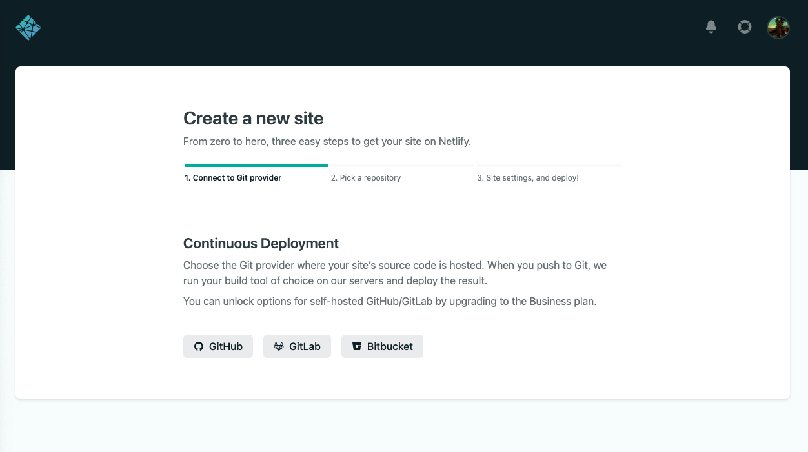
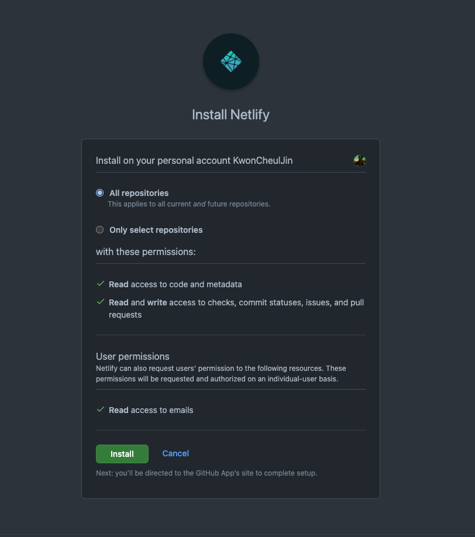
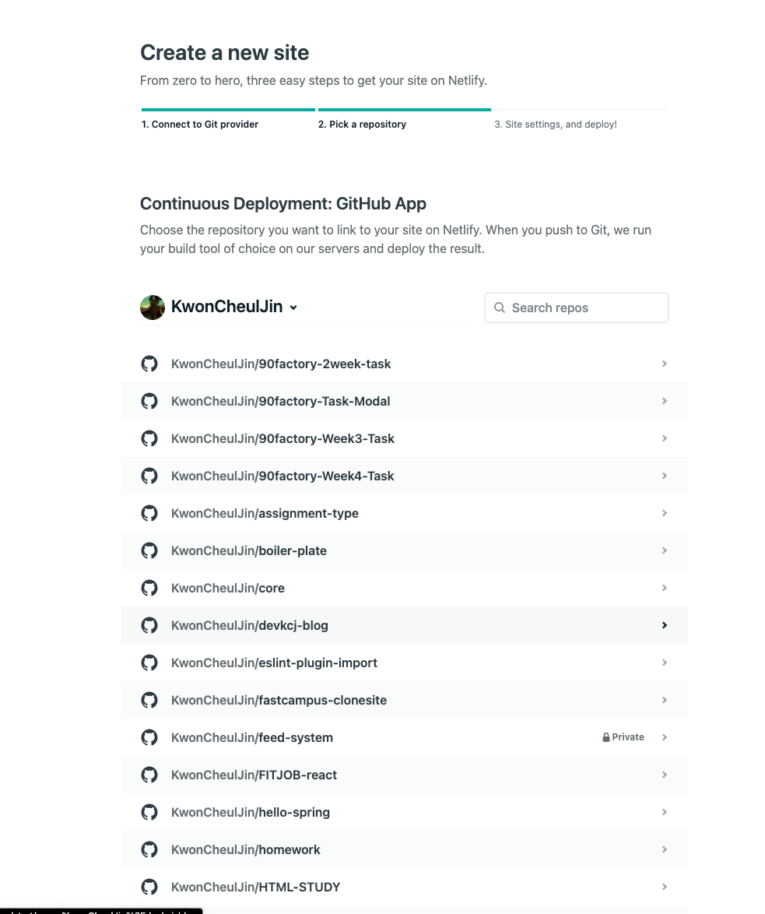
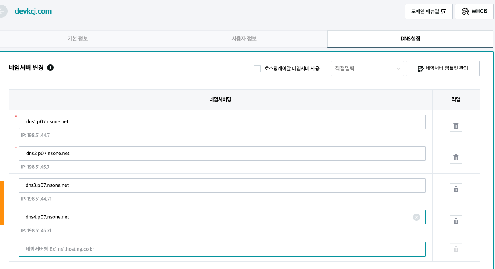
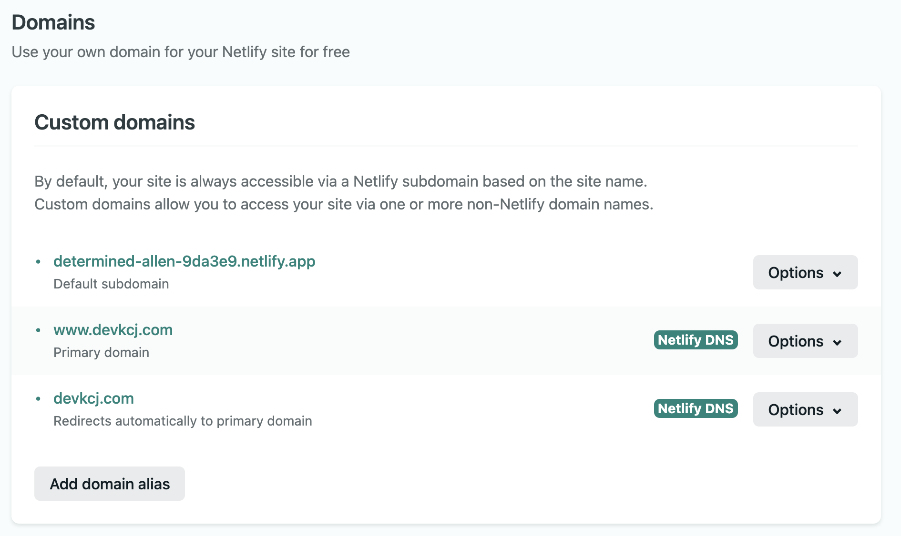
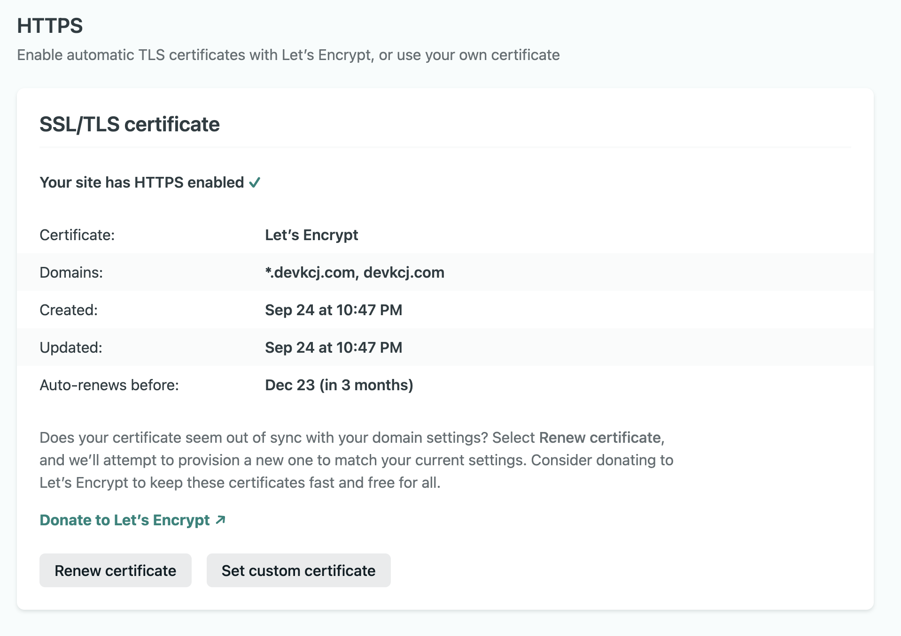
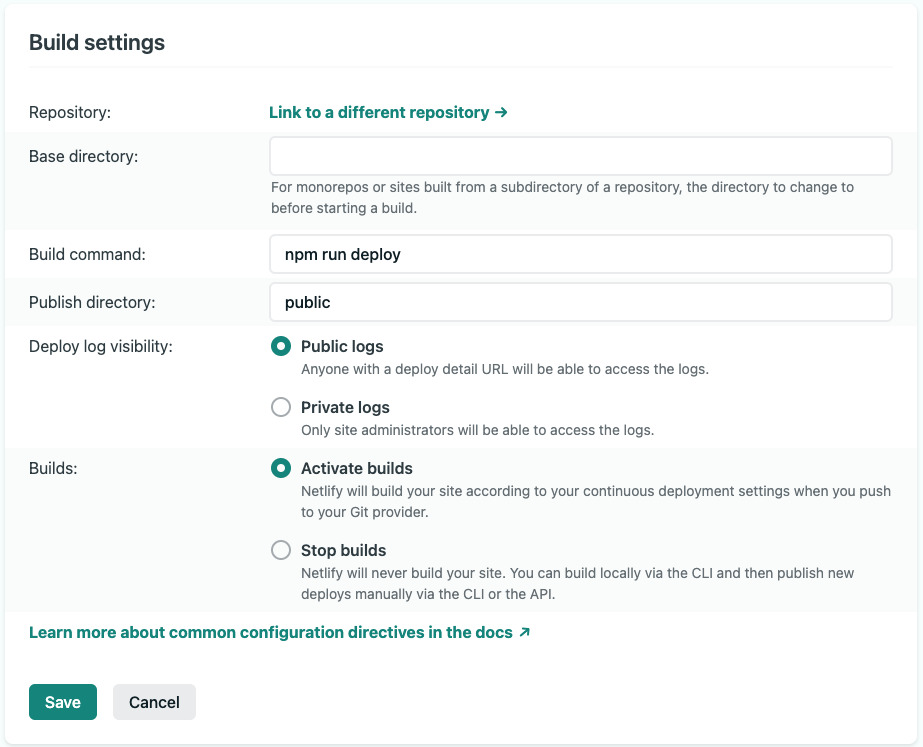
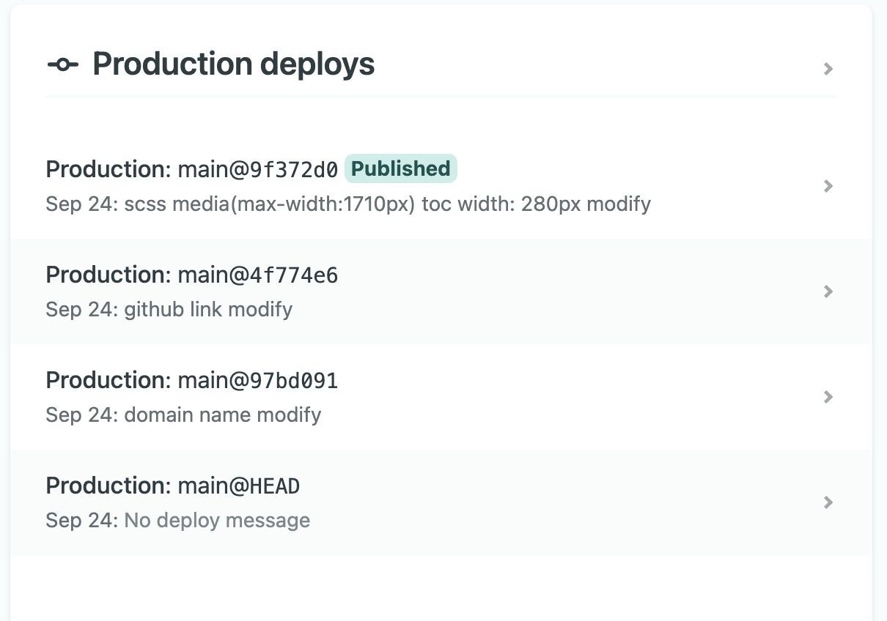

## 나의 개인 블로그의 시작

SI로 취업 후 첫 파견을 나와서 기획이 마무리가 안 된 시점에 투입이 되어 특별히 진행되는 것 없이 시간을 보내다가 개인 블로그를 만들어서 TIL이라도 기록해보자!라는 마음으로 검색하던 중 요즘 gatsby로 정적 블로그를 손쉽게 많이들 만드는 것 같아서 줌코딩님의 테마로 도메인도 사서 드디어 첫 글을 게시해 봅니다!

## 1. Netlify 로그인

먼저 Gatsby 테마로 Github blog를 만드는 것은 줌코딩님께서 자세히 올려놓으셔서 추가로 게시하지는 않습니다.



Github repository를 연결을 먼저 해줘야 한다. Github에 로그인 되어있는 상태에서 Netlify에 들어가서 연동을 해주면 됩니다.



그리고 인스톨 페이지에서 특별하게 건들지 않고 기본 설정으로 진행을 하였습니다.

## 2. Blog Repository 연결하기



그 다음에 나는 모든 저장소로 연결을 하여서 내 저장소가 전부 다 나오는데 그 중에서 블로그 저장소를 연결해주면 됩니다.

## 3. Domain Settings

저는 도메인을 구매하였기 때문에 도메인을 따로 설정해 주고 Name server를 내가 구매한 도메인 설정페이지에서 네임서버를 변경을 해줘야 합니다.


네임서버를 아래와 같이 DNS설정 페이지에서 변경을 해주면 됩니다.

> 저는 Hosting.kr에서 도메인을 구매하였습니다.

`Hosting.kr 설정 페이지`



네임서버가 잘 변경되면 Netlify DNS로 변경이 됩니다.

`위치 : Site settings > Domain management > Domains, HTTPS `



HTTPS는 네임서버 변경 후 바로 적용이 되지는 않습니다. 조금 기다리면 자동으로 적용이 됩니다.



## 4. Build Settings

`위치 : Site settings > Domain management > Build & deploy `



저는 `Build command`를 `npm run deploy`로 변경해 주었습니다.

블로그 초기 설정 할 때 `package.json`에서 아래와 같이 변경을 해주었기 때문에 `deploy`로 변경해야 `git`에 `push`시 자동 `published`가 됩니다.

```json
{
  "scripts": {
    "deploy": "gatsby build && gh-pages -d public" // 추가
  }
}
```

## 5. Published!



블로그는 저번주에 개설했었는데 이제서야 첫 게시를 해보았습니다.
나름 기록해보려고 스샷도 찍고 그래도 다른 사람이 봤을 때 따라 할 수 있을 정도로 기록 해보려고는 했는데 쉽지는 않네요!
생각보다 시간도 많이 걸리고 아직 Markdown사용법이 익숙하지는 않아서 복붙으로 하고 있는데 시간내서 자주 사용하는 마크다운 사용법을 정리해서 올려봐야겠습니다.

```toc

```
