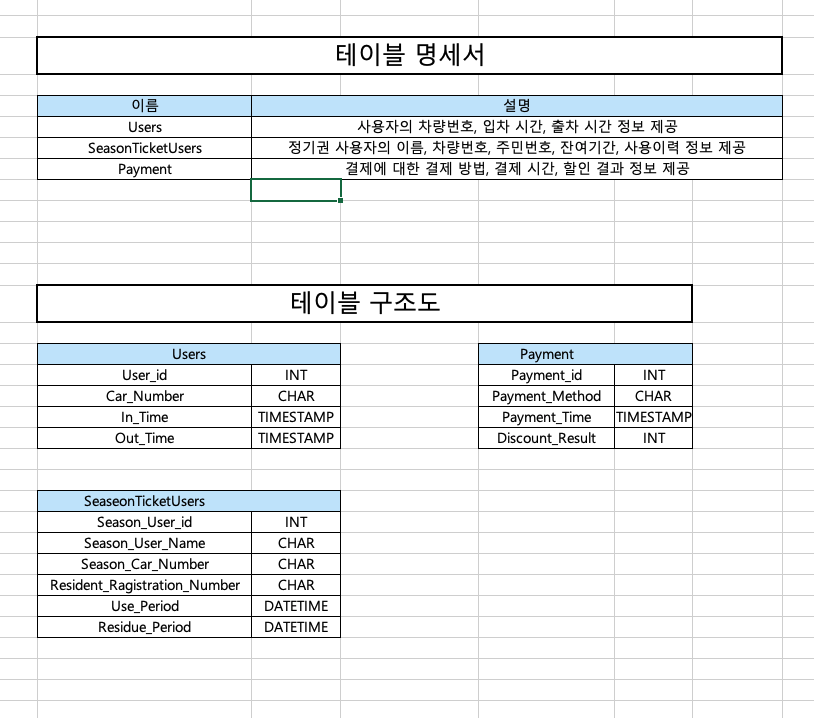

오늘부터 회사에서 배웠던 점이나 내가 기록 해야겠다고 생각 된 부분에 대해서 적어보려고 한다.
매일 집에와서 강의를 보면서 공부하는 것도 좋지만 회사에서 직접 알게 된 부분이나 현재 내가 배운 부분이 나중에 이곳을 떠나 다른 곳으로 갔을 때 잘된 상황이었는지 비교를 해보고 싶기 때문이다.

## 1. 테이블 구조도 확인받기

- 이사님께서 와이어프레임을 보고 DB테이블이 어떻게 나와야 할 지 고민해보라고 하여서 나 나름대로 고민해서 확인을 받았다.

- 테이블 명세서는 작성하지 않았고 구조도로 필요하다고 생각되는 부분을 작성해서 검토받았는데 이사님이 생각하고 계신거랑 내가 보여드린 결과물이 너무 달랐다.

  1. 일단 와이어프레임에 맞춰서 화면에 나와야하는 데이터가 어떤 것인지 구분하라.
  2. 처음부터 영문이름으로 작성하기 어려우면 한글로 모두 나열해라.
  3. 공통관리가 되는 컬럼들을 따로 그룹해주는 테이블을 만들고 그것을 코드화하는 테이블을 만든다.

- 최소한 위의 내용이 포함되는 테이블 명세서가 작성되야 하는데 나는 너무 단편적인
  생각으로 구조도만 작성했던 거였다.
- 이사님께 들은 내용을 토대로 다시 한 번 고민해서 작성해보았다.

## 2. 테이블 명세서 작성하기

- 테이블 명세서를 작성 할 때 부트캠프 교육에서 작성했었던게 기억이 나서 그것을 토대로 다시 작성해 보았다.
- 아래에 테이블 명세 및 구조도는 부트캠프에서 교육 받을 때 작성하였던 거였는데
  이것보다는 테이블 갯수랑 컬럼들이 많이 차이난다.



- 테이블 명세서(개략)부터 구조도는 현재 테이블명과 컬럼명만 작성해 놓은 상태로 오늘 하루를 마무리했다.
- 다시 작성하면서 느낀점은 내가 처음에 작성했던 구조도가 구체적이지 않고 너무 단편적이라는 것을 더 정확하게 느낄 수 있었고, 와이어프레임을 토대로 완전하지는 않지만 어떤 데이터가 들어와야 하는지에 대한 방향성이 조금은 잡혔던 것 같다.
- 내일 더 고민해서 다듬을 부분이 많지만 피드백 받은 부분을 토대로 잘 작성해봐야겠다.

`현재 내가 일하고 있는 방식이 잘 된 방식인지는 확실하게 모르겠다. DB에 대해서 생각해보라고 얘기 해주셨을 때도 나 나름대로 생각해서 가져간 것이었지만 애초에 작성 가이드를 조금이라도 알려주고 '작성해와바' 라고 했다면 그래도 내 결과물이 지금과 같았을까? 라는 생각을 한 하루였다. 그래도 내가 느낀 부분은 있었으니 그걸로 퉁 쳤다고 생각해야겠다.`

```toc

```
