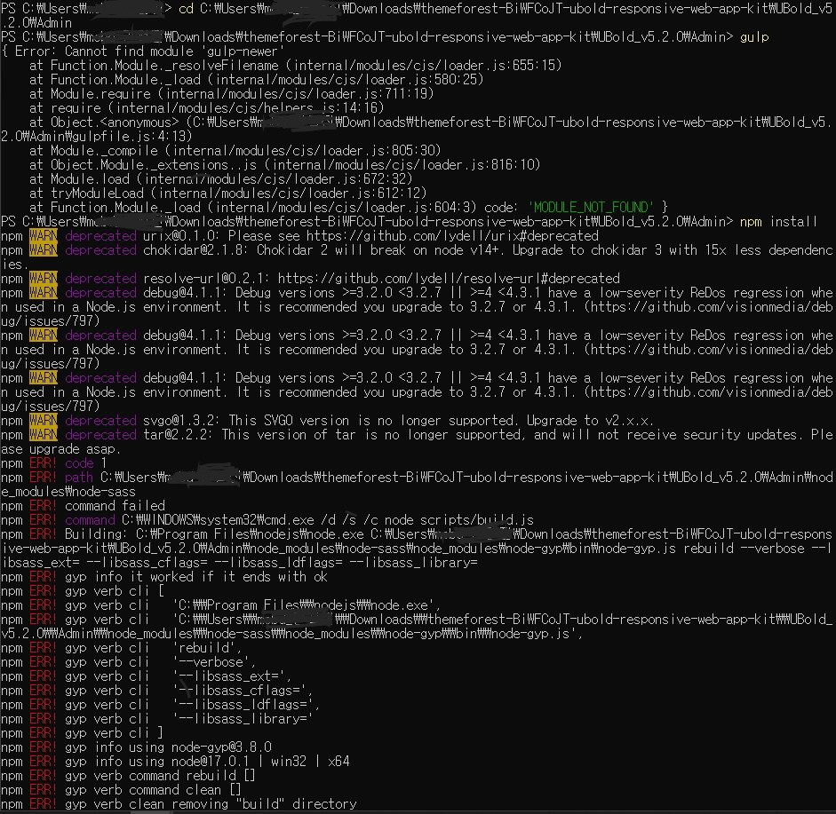
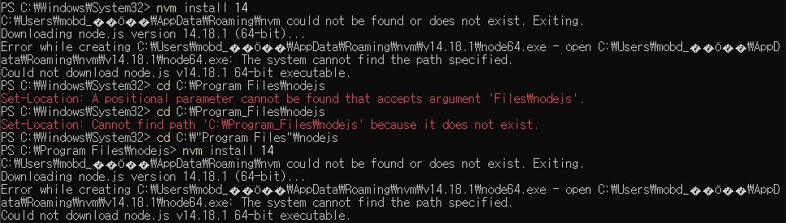
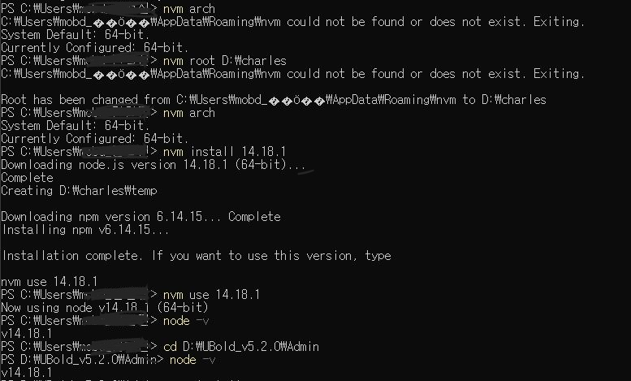
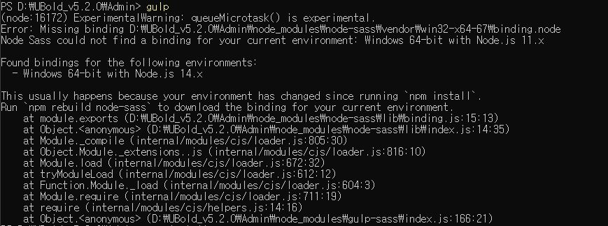
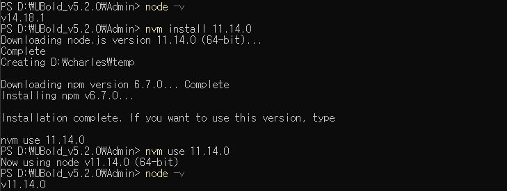
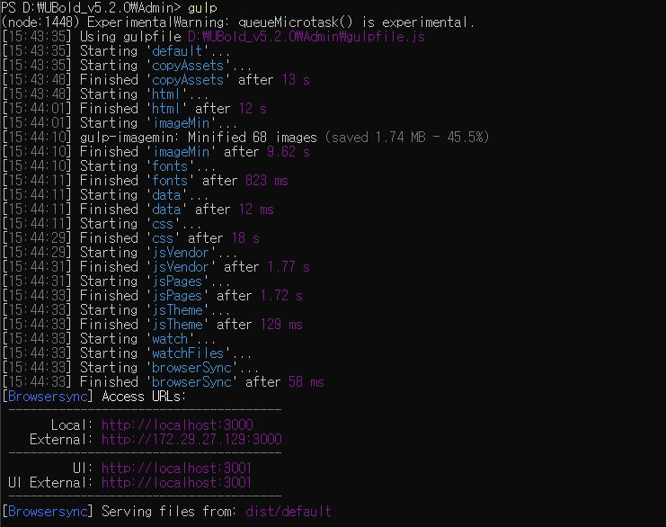

오늘은 이사님이 해보라고 했던 DB관련 업무를 마무리 짓고 내일부터는 프로토타입 화면 개발 하는 업무로 전환한다.
DB설계 관련 이사님께서 주셨던 미션이 무언가 말끔하게 끝났다고 하기에는 부족한게 많았지만 그래도 흐름을 감잡는데는 도움이 되었던 것 같다.
테이블을 만들도 쿼리를 작성하는 것은 나중에 또 고생해야 할 것 같지만...

## 얻은 것은 기록으로!

- 나는 DB관계를 생각 할 때 JOIN 쿼리가 많으면 성능상에 문제가 많을 거라고 생각했다.

- 하지만 이사님이 해주신 말은 사용자가 많지 않은 어드민시스템의 경우에는 3개의 테이블을 JOIN해도 성능상에 크게 딜레이가 되지 않는다고 했다.

- 시간이 좀 지나서 DB에 데이터가 많이 쌓였을 때는 마이그레이션을 고려해봐야 겠지만 현재는 크게 고려해야 할 사항은 아니다.

- 공통코드나 메뉴테이블의 경우는 한 번 등록하면 바뀌지 않는 테이블이다.

- 데이터가 계속 저장되는 테이블 같은 경우 어떤 방법으로 최신 데이터를 보여줄 시 고민해야된다. 등등

- 많은 걸 알려 주셨지만 내가 기억해서 기록해놨던 내용은 이정도...

- 나중에 테이블 및 쿼리 작성할 때 현재 시스템의 흐름을 잘 기억해둬야겠다.

## 화면 개발 전 어드민 템플릿 확인!

- 화면개발 전에 현재 FO관련 개발자가 없어서 프로토타입은 어드민 템플릿을 구매해서 와이어프레임에 맞게 템플릿을 수정해서 개발을 한다.

- 오늘은 템플릿을 사용 전에 템플릿을 setup하는 방법을 템플릿 Document를 보고 실행 해 보았는데 이 템플릿은 gulp.js를 활용해서 실행되게 되어있었다.

- gulp.js가 처음이어서 차근차근 실행해 보기로 하였다.

  1. nodejs와 gulp 설치를 편하게 하기 위해서 windows에서 소프트웨어 설치툴을 다운받았다
  2. [chocolatey](https://community.chocolatey.org/courses/installation/installing?method=installing-chocolatey)를 Basic으로 PowerShell에 설치를 하였다.
  3. chocolatey는 사용법이 어렵지 않아서 PowerShell에서 nodejs와 yarn을 설치했다.

  ```bash
  choco install nodejs
  choco install yarn
  ```

  4. 그리고 windows에서는 nvm을 사용하려면 직접 설치를 해줘야 사용이 가능하다. 그래서 구글링을 검색해서 [Heropy](https://heropy.blog/2018/02/17/node-js-install/)님의 블로그에서 정보를 얻어서 설치해주었다.

- 이렇게 셋팅을 해주고 이제 본격적으로 템플릿폴더에 가서 gulp를 사용하기 위해서 npm install을 해서 node_modules를 다운받았다.
  ```bash
  npm install
  ```

## 하지만 내 마음처럼 되는 것은 없었다.

- 처음부터 에러 발생!!!

```bash
  PS C:\Users\username\Downloads\themeforest-BiWFCoJT-ubold-responsive-web-app-kit\UBold_v5.2.0\Admin> npm install
npm WARN deprecated ini@1.3.5: Please update to ini >=1.3.6 to avoid a prototype pollution issue
npm WARN deprecated urix@0.1.0: Please see https://github.com/lydell/urix#deprecated
npm WARN deprecated har-validator@5.1.3: this library is no longer supported
npm WARN deprecated chokidar@2.1.8: Chokidar 2 will break on node v14+. Upgrade to chokidar 3 with 15x less dependencies.
npm WARN deprecated resolve-url@0.2.1: https://github.com/lydell/resolve-url#deprecated
npm WARN deprecated debug@4.1.1: Debug versions >=3.2.0 <3.2.7 || >=4 <4.3.1 have a low-severity ReDos regression when used in a Node.js environment. It is recommended you upgrade to 3.2.7 or 4.3.1. (https://github.com/visionmedia/debug/issues/797)
npm WARN deprecated debug@4.1.1: Debug versions >=3.2.0 <3.2.7 || >=4 <4.3.1 have a low-severity ReDos regression when used in a Node.js environment. It is recommended you upgrade to 3.2.7 or 4.3.1. (https://github.com/visionmedia/debug/issues/797)
npm WARN deprecated debug@4.1.1: Debug versions >=3.2.0 <3.2.7 || >=4 <4.3.1 have a low-severity ReDos regression when used in a Node.js environment. It is recommended you upgrade to 3.2.7 or 4.3.1. (https://github.com/visionmedia/debug/issues/797)
npm WARN deprecated debug@3.2.6: Debug versions >=3.2.0 <3.2.7 || >=4 <4.3.1 have a low-severity ReDos regression when used in a Node.js environment. It is recommended you upgrade to 3.2.7 or 4.3.1. (https://github.com/visionmedia/debug/issues/797)
npm WARN deprecated uuid@3.4.0: Please upgrade  to version 7 or higher.  Older versions may use Math.random() in certain circumstances, which is known to be problematic.  See https://v8.dev/blog/math-random for details.
npm WARN deprecated request@2.88.2: request has been deprecated, see https://github.com/request/request/issues/3142
npm WARN deprecated svgo@1.3.2: This SVGO version is no longer supported. Upgrade to v2.x.x.
npm WARN deprecated tar@2.2.2: This version of tar is no longer supported, and will not receive security updates. Please upgrade asap.
npm WARN deprecated popper.js@1.16.1: You can find the new Popper v2 at @popperjs/core, this package is dedicated to the legacy v1
npm WARN deprecated core-js@2.6.11: core-js@<3.3 is no longer maintained and not recommended for usage due to the number of issues. Because of the V8 engine whims, feature detection in old core-js versions could cause a slowdown up to 100x even if nothing is polyfilled. Please, upgrade your dependencies to the actual version of core-js.
npm ERR! code 1
npm ERR! path C:\Users\username\Downloads\themeforest-BiWFCoJT-ubold-responsive-web-app-kit\UBold_v5.2.0\Admin\node_modules\node-sass
npm ERR! command failed
npm ERR! command C:\WINDOWS\system32\cmd.exe /d /s /c node scripts/build.js
npm ERR! Building: C:\Program Files\nodejs\node.exe C:\Users\username\Downloads\themeforest-BiWFCoJT-ubold-responsive-web-app-kit\UBold_v5.2.0\Admin\node_modules\node-gyp\bin\node-gyp.js rebuild --verbose --libsass_ext= --libsass_cflags= --libsass_ldflags= --libsass_library=
npm ERR! gyp info it worked if it ends with ok
npm ERR! gyp verb cli [
npm ERR! gyp verb cli   'C:\\Program Files\\nodejs\\node.exe',
npm ERR! gyp verb cli   'C:\\Users\\username\\Downloads\\themeforest-BiWFCoJT-ubold-responsive-web-app-kit\\UBold_v5.2.0\\Admin\\node_modules\\node-gyp\\bin\\node-gyp.js',
npm ERR! gyp verb cli   'rebuild',
npm ERR! gyp verb cli   '--verbose',
npm ERR! gyp verb cli   '--libsass_ext=',
npm ERR! gyp verb cli   '--libsass_cflags=',
npm ERR! gyp verb cli   '--libsass_ldflags=',
npm ERR! gyp verb cli   '--libsass_library='
npm ERR! gyp verb cli ]
npm ERR! gyp info using node-gyp@3.8.0
npm ERR! gyp info using node@17.0.1 | win32 | x64
npm ERR! gyp verb command rebuild []
npm ERR! gyp verb command clean []
npm ERR! gyp verb clean removing "build" directory
npm ERR! gyp verb command configure []
npm ERR! gyp verb check python checking for Python executable "python2" in the PATH
npm ERR! gyp verb which failed Error: not found: python2
npm ERR! gyp verb which failed     at getNotFoundError (C:\Users\username\Downloads\themeforest-BiWFCoJT-ubold-responsive-web-app-kit\UBold_v5.2.0\Admin\node_modules\which\which.js:13:12)
npm ERR! gyp verb which failed     at F (C:\Users\username\Downloads\themeforest-BiWFCoJT-ubold-responsive-web-app-kit\UBold_v5.2.0\Admin\node_modules\which\which.js:68:19)
npm ERR! gyp verb which failed     at E (C:\Users\username\Downloads\themeforest-BiWFCoJT-ubold-responsive-web-app-kit\UBold_v5.2.0\Admin\node_modules\which\which.js:80:29)
npm ERR! gyp verb which failed     at C:\Users\username\Downloads\themeforest-BiWFCoJT-ubold-responsive-web-app-kit\UBold_v5.2.0\Admin\node_modules\which\which.js:89:16
npm ERR! gyp verb which failed     at C:\Users\username\Downloads\themeforest-BiWFCoJT-ubold-responsive-web-app-kit\UBold_v5.2.0\Admin\node_modules\isexe\index.js:42:5
npm ERR! gyp verb which failed     at C:\Users\username\Downloads\themeforest-BiWFCoJT-ubold-responsive-web-app-kit\UBold_v5.2.0\Admin\node_modules\isexe\windows.js:36:5
npm ERR! gyp verb which failed     at FSReqCallback.oncomplete (node:fs:198:21)
npm ERR! gyp verb which failed  python2 Error: not found: python2
npm ERR! gyp verb which failed     at getNotFoundError (C:\Users\username\Downloads\themeforest-BiWFCoJT-ubold-responsive-web-app-kit\UBold_v5.2.0\Admin\node_modules\which\which.js:13:12)
npm ERR! gyp verb which failed     at F (C:\Users\username\Downloads\themeforest-BiWFCoJT-ubold-responsive-web-app-kit\UBold_v5.2.0\Admin\node_modules\which\which.js:68:19)
npm ERR! gyp verb which failed     at E (C:\Users\username\Downloads\themeforest-BiWFCoJT-ubold-responsive-web-app-kit\UBold_v5.2.0\Admin\node_modules\which\which.js:80:29)
npm ERR! gyp verb which failed     at C:\Users\username\Downloads\themeforest-BiWFCoJT-ubold-responsive-web-app-kit\UBold_v5.2.0\Admin\node_modules\which\which.js:89:16
npm ERR! gyp verb which failed     at C:\Users\username\Downloads\themeforest-BiWFCoJT-ubold-responsive-web-app-kit\UBold_v5.2.0\Admin\node_modules\isexe\index.js:42:5
npm ERR! gyp verb which failed     at C:\Users\username\Downloads\themeforest-BiWFCoJT-ubold-responsive-web-app-kit\UBold_v5.2.0\Admin\node_modules\isexe\windows.js:36:5
npm ERR! gyp verb which failed     at FSReqCallback.oncomplete (node:fs:198:21) {
npm ERR! gyp verb which failed   code: 'ENOENT'
npm ERR! gyp verb which failed }
npm ERR! gyp verb check python checking for Python executable "python" in the PATH
npm ERR! gyp verb which failed Error: not found: python
npm ERR! gyp verb which failed     at getNotFoundError (C:\Users\username\Downloads\themeforest-BiWFCoJT-ubold-responsive-web-app-kit\UBold_v5.2.0\Admin\node_modules\which\which.js:13:12)
npm ERR! gyp verb which failed     at F (C:\Users\username\Downloads\themeforest-BiWFCoJT-ubold-responsive-web-app-kit\UBold_v5.2.0\Admin\node_modules\which\which.js:68:19)
npm ERR! gyp verb which failed     at E (C:\Users\username\Downloads\themeforest-BiWFCoJT-ubold-responsive-web-app-kit\UBold_v5.2.0\Admin\node_modules\which\which.js:80:29)
npm ERR! gyp verb which failed     at C:\Users\username\Downloads\themeforest-BiWFCoJT-ubold-responsive-web-app-kit\UBold_v5.2.0\Admin\node_modules\which\which.js:89:16
npm ERR! gyp verb which failed     at C:\Users\username\Downloads\themeforest-BiWFCoJT-ubold-responsive-web-app-kit\UBold_v5.2.0\Admin\node_modules\isexe\index.js:42:5
npm ERR! gyp verb which failed     at C:\Users\username\Downloads\themeforest-BiWFCoJT-ubold-responsive-web-app-kit\UBold_v5.2.0\Admin\node_modules\isexe\windows.js:36:5
npm ERR! gyp verb which failed     at FSReqCallback.oncomplete (node:fs:198:21)
npm ERR! gyp verb which failed  python Error: not found: python
npm ERR! gyp verb which failed     at getNotFoundError (C:\Users\username\Downloads\themeforest-BiWFCoJT-ubold-responsive-web-app-kit\UBold_v5.2.0\Admin\node_modules\which\which.js:13:12)
npm ERR! gyp verb which failed     at F (C:\Users\username\Downloads\themeforest-BiWFCoJT-ubold-responsive-web-app-kit\UBold_v5.2.0\Admin\node_modules\which\which.js:68:19)
npm ERR! gyp verb which failed     at E (C:\Users\username\Downloads\themeforest-BiWFCoJT-ubold-responsive-web-app-kit\UBold_v5.2.0\Admin\node_modules\which\which.js:80:29)
npm ERR! gyp verb which failed     at C:\Users\username\Downloads\themeforest-BiWFCoJT-ubold-responsive-web-app-kit\UBold_v5.2.0\Admin\node_modules\which\which.js:89:16
npm ERR! gyp verb which failed     at C:\Users\username\Downloads\themeforest-BiWFCoJT-ubold-responsive-web-app-kit\UBold_v5.2.0\Admin\node_modules\isexe\index.js:42:5
npm ERR! gyp verb which failed     at C:\Users\username\Downloads\themeforest-BiWFCoJT-ubold-responsive-web-app-kit\UBold_v5.2.0\Admin\node_modules\isexe\windows.js:36:5
npm ERR! gyp verb which failed     at FSReqCallback.oncomplete (node:fs:198:21) {
npm ERR! gyp verb which failed   code: 'ENOENT'
npm ERR! gyp verb which failed }
npm ERR! gyp verb could not find "python". checking python launcher
npm ERR! gyp verb could not find "python". guessing location
npm ERR! gyp verb ensuring that file exists: C:\Python27\python.exe
npm ERR! gyp ERR! configure error
npm ERR! gyp ERR! stack Error: Can't find Python executable "python", you can set the PYTHON env variable.
npm ERR! gyp ERR! stack     at PythonFinder.failNoPython (C:\Users\username\Downloads\themeforest-BiWFCoJT-ubold-responsive-web-app-kit\UBold_v5.2.0\Admin\node_modules\node-gyp\lib\configure.js:484:19)
npm ERR! gyp ERR! stack     at PythonFinder.<anonymous> (C:\Users\username\Downloads\themeforest-BiWFCoJT-ubold-responsive-web-app-kit\UBold_v5.2.0\Admin\node_modules\node-gyp\lib\configure.js:509:16)
npm ERR! gyp ERR! stack     at callback (C:\Users\username\Downloads\themeforest-BiWFCoJT-ubold-responsive-web-app-kit\UBold_v5.2.0\Admin\node_modules\graceful-fs\polyfills.js:299:20)
npm ERR! gyp ERR! stack     at FSReqCallback.oncomplete (node:fs:198:21)
npm ERR! gyp ERR! System Windows_NT 10.0.19043
npm ERR! gyp ERR! command "C:\\Program Files\\nodejs\\node.exe" "C:\\Users\\username\\Downloads\\themeforest-BiWFCoJT-ubold-responsive-web-app-kit\\UBold_v5.2.0\\Admin\\node_modules\\node-gyp\\bin\\node-gyp.js" "rebuild" "--verbose" "--libsass_ext=" "--libsass_cflags=" "--libsass_ldflags=" "--libsass_library="
npm ERR! gyp ERR! cwd C:\Users\username\Downloads\themeforest-BiWFCoJT-ubold-responsive-web-app-kit\UBold_v5.2.0\Admin\node_modules\node-sass
npm ERR! gyp ERR! node -v v17.0.1
npm ERR! gyp ERR! node-gyp -v v3.8.0
npm ERR! gyp ERR! not ok
npm ERR! Build failed with error code: 1
```

- 여기서 보인 단어는 python이었다. 그래서 해당 에러를 검색해 보니깐 [node-sass](https://github.com/JeremyEnglert/JointsWP/issues/317)관련 에러가 있어서 이거를 참조해서 해결해 보려고 하였다.

```bash
npm install --global windows-build-tools
npm install --global node-gyp
```

- 위 두개의 명령어를 입력하면 해결된다고 하여서 시도를 해보았다.

```bash
PS C:\Windows\System32> npm install --gplobal windows-build-tools
npm WARN deprecated har-validator@5.1.5: this library is no longer supported
npm WARN deprecated uuid@3.4.0: Please upgrade  to version 7 or higher.  Older versions may use Math.random() in certain circumstances, which is known to be problematic.  See https://v8.dev/blog/math-random for details.
npm WARN deprecated request@2.88.2: request has been deprecated, see https://github.com/request/request/issues/3142
npm WARN deprecated windows-build-tools@5.2.2: Node.js now includes build tools for Windows. You probably no longer need this tool. See https://github.com/felixrieseberg/windows-build-tools for details.
npm ERR! code 3221225786
npm ERR! path C:\Windows\System32\node_modules\windows-build-tools
npm ERR! command failed
npm ERR! command C:\WINDOWS\system32\cmd.exe /d /s /c node ./dist/index.js
Downloading python-2.7.15.amd64.msi
npm ERR! [>                                            ] 0.0% (0 B/s)
npm ERR! Downloaded python-2.7.15.amd64.msi. Saved to C:\Users\mobd_권철진\.windows-build-tools\python-2.7.15.amd64.msi.
Downloading vs_BuildTools.exe
npm ERR! [>                                            ] 0.0% (0 B/s)
npm ERR! Downloaded vs_BuildTools.exe. Saved to C:\Users\mobd_권철진\.windows-build-tools\vs_BuildTools.exe.
npm ERR!
npm ERR! Starting installation...
npm ERR! Launched installers, now waiting for them to finish.
npm ERR! This will likely take some time - please be patient!
npm ERR!
npm ERR! Status from the installers:
---------- Visual Studio Build Tools ----------
npm ERR! Still waiting for installer log file...
```

- 먼저 `npm install --global node-gyp`은 큰 문제없이 설치가 되었지만 `npm install --global windows-build-tools` 명령어를 실행하면 연결은 되었다고 뜨는데 그 뒤에는 20분정도를 기다려도 진행이 되지않아서 포기를 하고 다른 방법을 시도해 보기로 했다.

  

- 다시 처음으로 돌아가서 다른 문제점을 찾아보기로 했다. 그 다음으로 보인것이 node 버전이었다. 나는 처음에는 node 최신버전을 설치해서 17버전으로 실행했었는데 검색과정에서 node-sass에러가 버전이 안맞아서 에러가 난다는 것을 보고 14버전으로 다운그레이드 해줬다. 이 과정에서 또 다른 에러를 만나게 된다.

  

- 위 에러는 `nvm install 14` 버전으로 다운그레이드 하는 작업이었는데 처음 실수는 내가 버전에 관련해서 `14.18.1` 버전을 제대로 적어주지 않았던 부분이 계속 실패를 했었다. 그 뒤에 다시 버전을 제대로 적었는데도 안되길래 문제점을 찾아보았는데 `nvm_setup`이 설치된 경로의 폴더이름이 나의 한글이름으로 되어있어서 경로에러가 나는 거였다.

- 그래서 `nvm root`를 변경해주는 작업을 하였다. 아래의 사진처럼 경로를 변경해주니 `node version`이 잘 변경이 되었다.

  

- 위처럼 변경해주고 다시 `npm install`을 해주고 `node_modules`폴더가 잘 생성된 것을 확인하고 `gulp`를 실행해보았다.

  

- 에러만 잘 보면 쉬운 문제였는데 영어를 잘 못 해석해서 엉뚱한 부분을 수정하려고 삽질을 했다... 문제는 `node version을 11.x을 찾을 수 없다`라는 건데 결론은 node버전을 11.x로 바꾸면 해결되는 거였다.

  

- 버전을 다시 다운그레이드해주고나서 이제 `node_modules`를 다시 삭제하고 `npm install`을 진행한 후 `gulp`를 실행해보았다.

  

  

- 하루종일 에러를 해결하고 결국에는 `gulp`실행에 성공하였다!

- 삽질을 한 번 하고 나서 드는 생각은 에러코드를 자세히 보는게 중요하다는 거였다.

- 생각보다 그 안에서 다 얻을 수 있는 건데 내 눈에 보이는 것만 찾으려 하다보니 빙빙돌았던 것 같다. 그래도 해결해서 뿌듯했다.

- 내일 화면개발을 잘 해봐야겠다!

```toc

```
