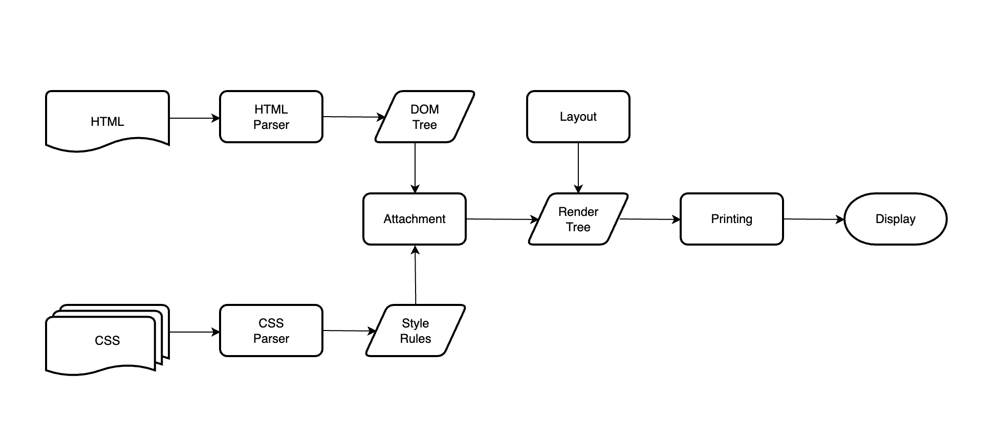
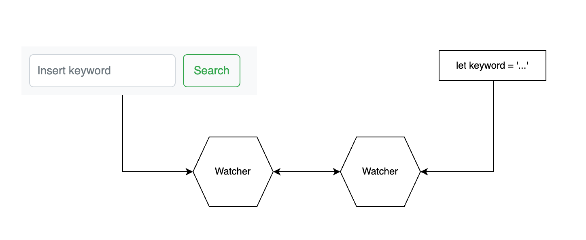
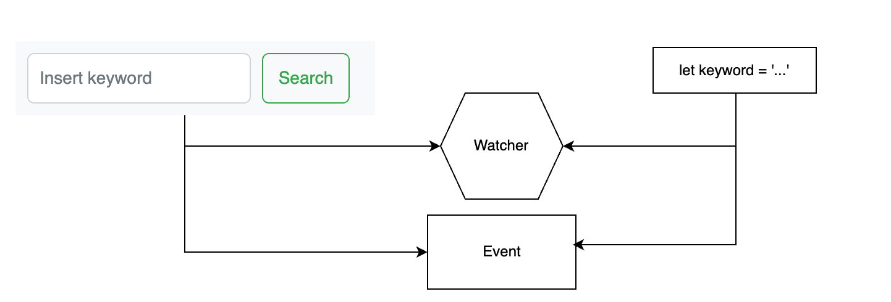

## - 목표

> - React + TDD를 이용한 프로젝트 적응하기
> - 타입스크립트 추가로 공부하기
> - 일주일에 1챕터 이상 진행한다.

## - 책을 읽게 된 계기

> SI에서 스타트업으로 이직을 하게 되면서 프론트엔드를 맡게 되었다. <br>그곳에서 React, Typescript를 기본적으로 사용하고 있어서 업무 적응을 위해 공부 할 것을 찾아 보던 중 React와 Typescript를 사용하면서 TDD까지 설명하는 책이 있어서 구매하게 되었다.

## - 작성 방법

> 책에 대한 내용을 나열하기 보다는 실습 위주의 내용 또는 유용한 내용을 기록한다.

# Chapter.1 - 리액트란?

- 이 장에서는 자바스크립트의 역사와 리액트의 특징에 대해서 기술하고 있다.

- 자바스크립트의 역사는 생략한다.

## 리액트의 특징

### 1. 가상 돔

- 가상 돔이 웹 퍼포먼스의 성능을 어떻게 향상 시키는지 이해하기 위해서는 브라우저에서 HTML, CSS가 렌더링 되는 부분의 이해가 필요하다.



    1. 브라우저가 네트워크를 통해 HTML을 전달받으면 브라우저의 렌더 엔진은 HTML을 파싱하여 돔 노드(DOM Node)로 이루어진 트리를 만든다.
    또한 CSS 파일과 각 엘리먼트의 인라인 스타일을 파싱하여 스타일 정보를 가진 새로운 스타일 렌더 트리를 만든다.

    2. 렌더 트리가 생성되면 브라우저는 Attachment라는 과정을 통해 스타일 정보를 계산, 렌터 트리의 모든 노드는 attach라는 메소드를 가지고 있는데, Attachment 과정에서 이 메소드를 호출하게 되며 해당 메소드는 스타일 정보를 계산하고 결과값을 객체로 반환한다.
    이 과정은 동기적으로 작동하며 만약 렌더 트리에 새로운 노드가 추가되면 해당 노드의 attach 메소드가 실행된다.

    3. 이후 레이아웃 과정을 거치게 된다.
    레이아웃 과정에서는 브라우저가 렌더 트리의 각 노드에 좌표를 부여하고 정확히 어디에 어떻게 표시되는지 결정하게 된다.

    4. 마지막으로 브라우저는 각 노드에 paint() 메소드를 호출하여 렌더링된 요소들에 색상을 입히는 Painting 과정을 거친 후 최정적으로 화면을 표시하게 된다.

<h3 style="text-align: center;">웹 브라우저 렌더링 과정</h3>

- 화면에 표시된 후 자바스크립트를 사용하여 돔을 조작하게 되면 각 노드에 좌표를 계산하고 부여하는 레이아웃 과정이 다시 수행, 이후 페인팅 과정도 다시 수행하게 된다.

- 여기서 레이아웃이 다시 수행되는 것을 리플로우(Reflow), 페인팅이 다시 수행되는 것을 리페인트(Repaint)라고 한다.

- 리플로우와 리페인트를 많이 수행하게 되면 웹 서비스의 성능 이슈가 발생하게 된다. 그래서 이러한 문제를 해결하기 위해 리액트는 화면에 표ㅕ시되는 돔과 동일한 돔을 메모리상에 만들고, 돔 조작이 발생하면 메모리 상에 생성한 가상 돔에서 모든 연산을 한 후 실제 돔을 갱신하여 리플로우와 리페인트의 연산을 최소화한다.

### 2.단방향 데이터 바인딩

- 앵귤러와 뷰(Vue)는 양방향 데이터 바인딩을 사용한다.



<h3 style="text-align: center;">양방향 데이터 바인딩</h3>

- 양방향 데이터 바인딩은 사용자 UI의 데이터 변경을 감시하는 Watcher와 자바스크립트 안에서 변경되는 데이터를 감시하는 Watcher를 통해 UI와 프로그램 안에 데이터를 자동으로 동기화해 주는 시스템이다.
- 프로그래머는 자바스크립트 내에 데이터 변경과 사용자 UI에서 데이터 변경 및 동기화를 크게 신경 쓰지 않고 프로그램을 작성할 수 있다.

- 단점으로는 데이터 동기화를 위해 데이터 하나에 두개의 Watcher가 사용되기 때문에 오버스펙일 경우가 발생할 수 있다. 또한 수많은 Watcher에 의해 반대로 성능 저하가 발생할 수 있다.

- 리액트는 양방향 데이터 바인딩이 가지는 문제점과 복잡성을 피하고자 단방향 데이터 바인딩을 채택하고 있다.



<h3 style="text-align: center;">단방향 데이터 바인딩</h3>

- 단방향 데이터 바인딩은 단 하나의 Watcher가 자바스크립트의 데이터 갱신을 감지하여 사용자의 UI 데이터를 갱신한다.
- 사용자의 데이터를 갱신할 때는 양방향 데이터 바인딩과 다르게 Watcher가 아닌 Event를 통해 데이터를 갱신하게 된다.
- 하나의 Watcher를 사용하기 때문에 양방향 데이터 바인딩에서 발생하는 문제들을 해결할 수 있고, 더 확실하게 데이터를 추적할 수 있다.
- 또한 리액트는 단방향 데이터 바인딩과 더불어 Flux라는 개념을 도입하여 데이터의 흐름이 한쪽으로만 진행되도록 하고 있다.

### 3. JSX

- 리액트에서는 JSX라는 독특한 문법을 가지고 있다.
- JSX는 자바스크립트와 HTML을 동시에 사용하며, HTML에 자바스크립트 변수들을 바로 사용할 수 있는 일종의 템플릿 언어(Template language)이다.

```jsx
const App = () => {
  const hello = 'Hello world!';
  return <div>{hello}</div>;
};
```

### 4. 선언형 프로그래밍

- 프로그래밍은 크게 명령형 프로그래밍과 선언형 프로그래밍으로 구별할 수 있다.
- 명령형 프로그래밍은 프로그래밍할 때 "어떻게(How)"에 집중
- 선언형 프로그래밍은 프로그래밍할 때 "무엇(What)에 집중

```jsx
// 명령형 프로그래밍
const double = (arr) => {
  let results = [];
  for (let i = 0; i < arr.length; i++) {
    results.push(arr[i] * 2);
  }
  return results;
};

// 선언형 프로그래밍
const double = (arr) => {
  return arr.map((elem) => elem * 2);
};
```

`명령형에서 선언형으로 리액트 JSX 예제`

```javascript
<script>
    var arr = [1, 2, 3, 4, 5];
    var elem = document.querySelector("#list");

    for(var i = 0; i < arr.length; i++) {
        var child = document.createElement("li");
        child.innerHTML = arr[i];
        elem.appendChild(child);
    }
</script>
```

<h3 style="text-align: center;">⬇️</h3>

```jsx
const arr = [1, 2, 3, 4, 5];

return (
  <ul>
    {arr.map((elem) => {
      <li>{elem}</li>;
    })}
  </ul>
);
```

- 선언형 프로그래밍은 코드를 예측할 수 있게 하고 디버깅을 쉽게 할 수 있도록 도와주므로 전체적인 코드 퀄리티 상승과 코드의 이해를 도와주는 효과를 얻을 수 있다.

### 5. 컴포넌트 기반

- 리액트로 웹 UI를 개발할 때는 "컴포넌트"라고 불리는 작고 고립된 코드들을 이요하여 구현하게 된다.

```jsx
const Title = () => {
  return <h1>Hello world</h1>;
};

const Button = () => {
  return <button>This is a Button</button>;
};

const App = () => {
  return (
    <div>
      <Title />
      <Button />
    </div>
  );
};
```

```toc

```
