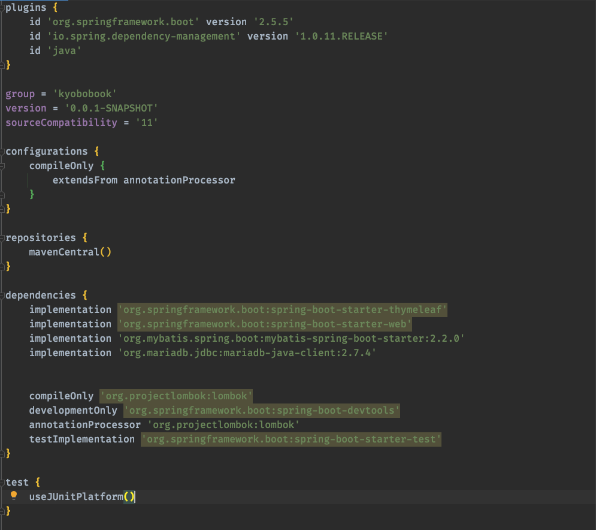
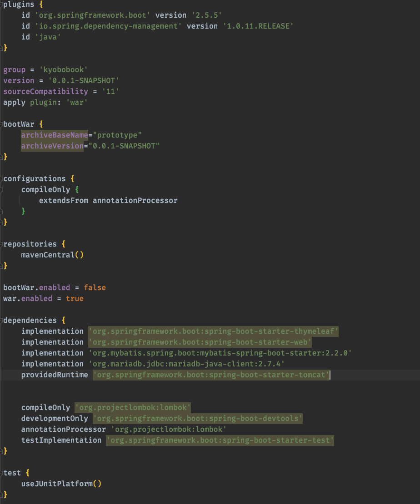
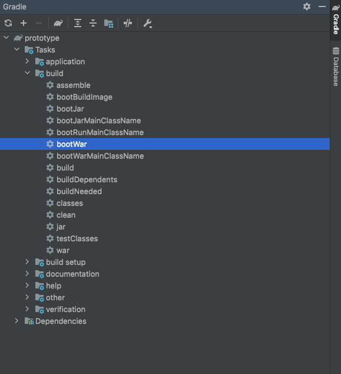
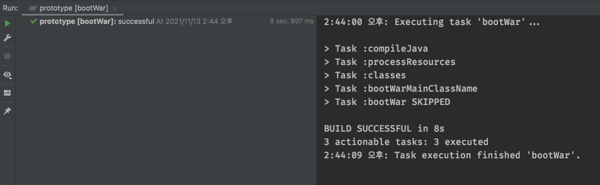
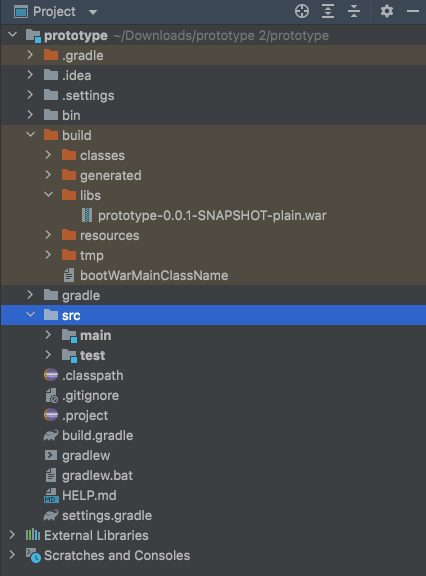
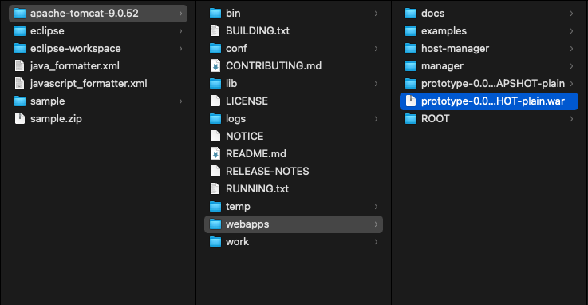
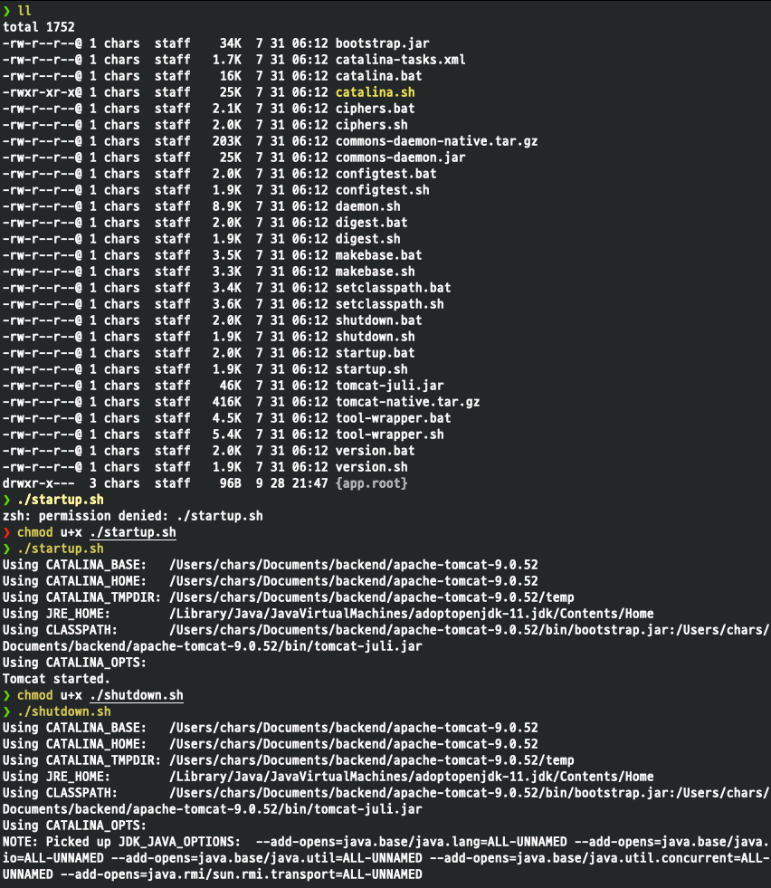
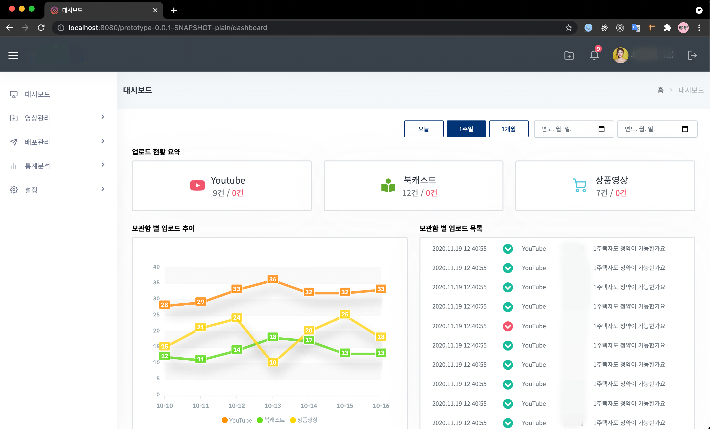

오랜만에 남기는 오늘의 기록
2주동안 VCMS 화면 퍼블리싱 작업으로 다른 기록은 남기지 못하고 나중에 타임리프 사용 관련해서 정리 해서 글을 남겨봐야겠다

- 오늘 남길 것은 퍼블리싱 작업이 끝난 후 내가 작업한 작업물을 다른 사람들과 공유해서 볼 수 있게 EC2에 올리는 작업을 해야 했는데 이 부분에서 문제가 생겼다.
- 나는 퍼블리싱 작업을 처음 하는 거였는데 내가 개발을 하는 입장이라 타임리프 탬플릿을 이용해서 화면 구성을 하였다. 반복되는 부분이 많다보니 fragment로 작업을 많이 하였고 그러다보니 쌩 html파일만 열면 그냥 볼 수가 없었다. 나의 작업물을 본 이사님은 그냥 html, css으로 작업했으면 서버까지 띄울일은 없었을 텐데라며... 하시면서 잘못했다고 하신건 아니지만 내가 듣기엔 내가 잘 못했다 라는 것처럼 들렸다... 그냥 내 느낌이겠지...
  아무튼 이런 사건으로 인해서 내가 작업한 파일을 EC2에서 WAS로 구동하려면 jar가 아닌 war로 배포를 해서 서버에 띄워야 했다.

- 그렇게 spring boot + tomcat연동으로 이사님이 찾아보라고 해서 구글링을 했는데 원하는 답을 찾을 수는 없었고 gradle에서 war파일을 생성해 로컬에서 tomcat을 구동해 배포하는 방법을 찾게 되어 작업한 내용을 기록한다.

## 1. War 파일 생성을 위한 설정

- `application.properties`에서 설정을 변경 해준다.

- 수정 전

  

  아래의 코드를 추가로 넣어준다.

  ```yml
  apply plugin: 'war'

  //War 생성관련 설정을 할 수 있습니다.
  //Name 과 Version, File Name 등을 설정할 수 있으며 따로
  //설정이 없다면 프로젝트명 + Version 이 붙어서 생성됩니다.

  bootWar {
      archiveBaseName="prototype"
      archiveVersion="0.0.1-SNAPSHOT"
  }

  bootWar.enabled = false
  war.enabled = true

  dependencies {
      providedRuntime 'org.springframework.boot:spring-boot-starter-tomcat'
  }

  ```

- 수정 후

  

## 2. SpringBoot Application class 설정

- 외장 톰캣으로 서비스를 제공하기 위해서는 SpringBootServletInitializer상속(configure 메서드 오버 라이딩)이 따로 필요하다. 기본 클래스에 SpringBootServletInitializer상속 시 SpringFramework의 Servlet 3.0 자원을 사용하고, 서블릿 컨테이너에 의해 시작될 때 애플리케이션이 구성된다.

  출처:[Hailey's Daily Logs\_](https://hye0-log.tistory.com/29)

```java
package kyobobook.prototype;

import org.springframework.boot.SpringApplication;
import org.springframework.boot.autoconfigure.SpringBootApplication;
import org.springframework.boot.builder.SpringApplicationBuilder;
import org.springframework.boot.web.servlet.support.SpringBootServletInitializer;

@SpringBootApplication
public class PrototypeApplication extends SpringBootServletInitializer {

    @Override
    protected SpringApplicationBuilder configure(SpringApplicationBuilder application) {
        return application.sources(PrototypeApplication.class);
    }


    public static void main(String[] args) {
        SpringApplication.run(PrototypeApplication.class, args);
    }

}

```

## 3. Gradle에서 War 파일 생성

- 위와 같이 수정이 끝난 후 `Gradle > build > bootWar`를 실행하면 아래와 같이 작업이 이뤄지고 war파일이 프로젝트 build > lib 폴더에 생성된다.
  

  

  

### 4. 로컬에서 war배포파일 실행하기

- war파일을 tomcat폴더 > webapps에 이동시키고 터미널은 bin폴더로 이동을 해서 서버를 실행한다.

  

- bin폴더로 이동해서 `startup.sh, shutdown.sh`파일을 이용해서 서버를 시작하고 종료하면 된다.

- 나는 따로 권한을 주지 않은 상태여서 권한을 부여하고 시작을 했다.

  ```zsh
  chmod u+x ./startup.sh
  chmod u+x ./shutdown.sh
  ```

  

- 이렇게 하고 로컬서버로 배포한 war파일명으로 접속하면 배포된 프로젝트에 접속 할 수 있다.

  

이렇게 한번 작업을 해보니깐 나중에 배포까지 어떻게 진행되는지 대략적으로 알 수 있었던 것 같다. springBoot 내장톰켓 덕분에 엄청 편하게 작업하고 사용했었는데 외장톰켓으로 배포되는 과정도 알게된 시간이었다.

gradle로 작업하면 eclipse와 IntelliJ IDEA와 같이 사용하기에 편했는데 이사님이 주신 소스 파일로 다시 작업을 하라고 해서 다시 적응하려면 좀 힘들것 같지만 어디가서 레거시를 만날 수도 있으니 그때는 편하게 작업 할 수 있을거라 생각하자

이번주도 너무 고생했다!!

```toc

```
